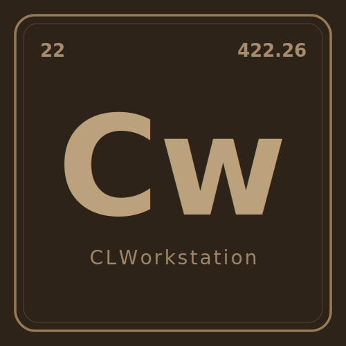

<p align="center">
  <a href="https://github.com/CascadingLabs/CLWorkstation">
    <picture>
      <source media="(prefers-color-scheme: dark)" srcset="media/logo-dark.svg">
      <source media="(prefers-color-scheme: light)" srcset="media/logo-light.svg">
      
    </picture>
  </a>
</p>

<p align="center">
  <a href="https://discord.gg/c8MKEaWEEK"></a>
  <a href="https://opensource.org/licenses/Apache-2.0"></a>
</p>

# CLWorkstation

Ansible playbook that installs a consistent SSH toolkit on any Linux server (Arch or Ubuntu) **per-user** — no root required for the tools themselves. One command and a fresh server has `lazydocker`, `btop`, `nvim` (+ LazyVim), `lazygit`, `ripgrep`, `fd`, `fzf`, `bat`, `eza`, `zoxide`, `starship`, plus a tested bash alias set.

Nothing lands outside `$HOME`, so coworkers sharing the box are untouched.

## How it runs

CLWorkstation runs in Ansible's **remote mode**: Ansible lives on your laptop
(the *control node*) and configures servers over SSH. Targets need only SSH
access and Python — nothing is installed on them beyond the tools in the
playbook itself. There's no agent, no daemon, and no open port besides SSH.

## One-time control-node setup

```bash
uv tool install ansible-core
ansible-galaxy collection install -r requirements.yml
cp inventory/hosts.yml.example inventory/hosts.yml
$EDITOR inventory/hosts.yml    # add your servers
```

## Everyday use

```bash
# Dry run against one host:
ansible-playbook site.yml --limit web-1 --check --diff

# Real run, all hosts:
ansible-playbook site.yml

# Just refresh the shell config:
ansible-playbook site.yml --tags shell
```

## What goes where on the target

| Path                                    | Contents                             |
|-----------------------------------------|--------------------------------------|
| `~/.local/bin/`                         | Static binaries (rg, fd, btop, …)    |
| `~/.local/share/nvim-linux64/`          | Full neovim install                  |
| `~/.config/nvim/`                       | LazyVim starter (only if absent)     |
| `~/.bashrc`                             | Thin rc that sources `~/.bashrc.d/*` |
| `~/.bashrc.d/{aliases,fzf,starship}.sh` | Templated shell fragments            |
| `~/.cache/clworkstation/`               | Sentinel files for idempotence       |

Your existing `~/.bashrc` is preserved once at `~/.bashrc.pre-clworkstation`.

## Repo structure

```
CLWorkstation/
├── ansible.cfg                 ← sets inventory, disables host-key checks
├── site.yml                    ← top-level play: common → tools → shell → neovim
├── requirements.yml            ← ansible-galaxy collections
├── inventory/
│   ├── hosts.yml.example       ← copy to hosts.yml (gitignored)
│   └── hosts.yml               ← your servers, not committed
├── group_vars/workstations.yml ← feature toggles + path vars
├── vars/
│   ├── tools.yml               ← tool catalog: pinned versions + release URLs
│   ├── Archlinux.yml           ← distro base packages
│   └── Debian.yml
├── roles/
│   ├── common/                 ← creates ~/.local/bin, ~/.config, …
│   ├── tools/                  ← downloads + installs binaries from tools.yml
│   ├── shell/                  ← templates bashrc + .bashrc.d/*.sh
│   └── neovim/                 ← clones LazyVim starter if absent
├── molecule/default/           ← Arch + Ubuntu container tests (prepare → converge → verify)
└── media/                      ← logo assets (see Assets repo conventions)
```

## Pinning a new tool version

Edit `vars/tools.yml`, bump `version` and `url`, delete the matching sentinel
file under `~/.cache/clworkstation/` on the target, then rerun the playbook.

## Local testing

Molecule and the Docker driver no longer ship as a single package, and
`uv tool` puts each tool in its own venv. Install both into one env so
`molecule` can find `ansible-config` and the docker plugin at runtime:

```bash
uv tool install --force molecule \
  --with 'molecule-plugins[docker]' \
  --with docker \
  --with ansible
```

Then run from the **repo root** (not from `molecule/default/`), with the
molecule tool's bin on `PATH` so `ansible-config` resolves:

```bash
export PATH="$HOME/.local/share/uv/tools/molecule/bin:$PATH"
molecule test   # Arch + Ubuntu containers → converge → idempotence → verify
```

Useful sub-commands during development:

```bash
molecule converge          # apply once, leave containers running
molecule login -h cl-arch  # shell into a converged container
molecule verify            # re-run verify.yml only
molecule destroy           # tear down
```

A `prepare.yml` runs before `converge.yml` and bootstraps python on the bare
Arch image and refreshes apt + installs `git` on the Ubuntu image — both are
prerequisites that the playbook itself assumes a real workstation already has.

## Adding a new tool

1. Add an entry to `vars/tools.yml` with the release URL and the archive-relative path to the binary.
2. Add the binary name to `molecule/default/verify.yml`.
3. Run `molecule test` — if both distros come up green, you're done.

## Related projects

| Project        | Repo                                                                     |
|----------------|--------------------------------------------------------------------------|
| Cascading Labs | [github.com/CascadingLabs](https://github.com/CascadingLabs)             |
| Assets         | [github.com/CascadingLabs/Assets](https://github.com/CascadingLabs/Assets) |
| QScrape        | [github.com/CascadingLabs/QScrape](https://github.com/CascadingLabs/QScrape) |
| Yosoi          | [github.com/CascadingLabs/Yosoi](https://github.com/CascadingLabs/Yosoi) |
| VoidCrawl      | [github.com/CascadingLabs/VoidCrawl](https://github.com/CascadingLabs/VoidCrawl) |

## Community

- **Discord:** [discord.gg/c8MKEaWEEK](https://discord.gg/c8MKEaWEEK)
- **Support:** see [SUPPORT.md](SUPPORT.md)
- **Security:** see [SECURITY.md](SECURITY.md)
- **Code of Conduct:** see [CODE_OF_CONDUCT.md](CODE_OF_CONDUCT.md)

## Contact

[contact@cascadinglabs.com](mailto:contact@cascadinglabs.com)

## License

Apache 2.0 — see [LICENSE](LICENSE).
